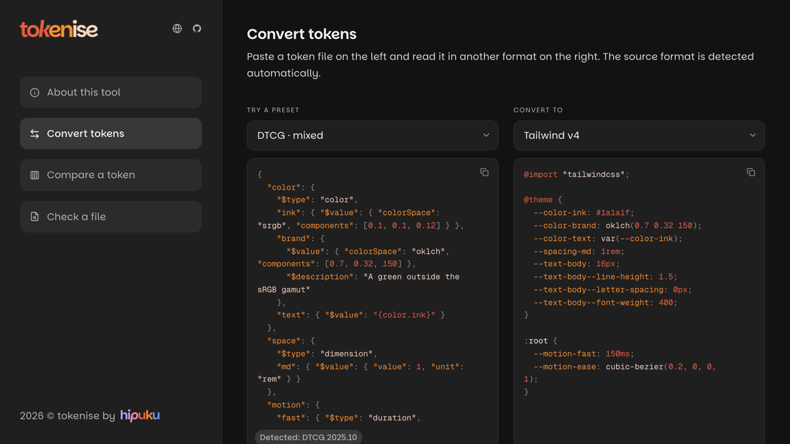

# tokenise



Design token conversion in the browser. Live at [tokenise.hipuku.dev](https://tokenise.hipuku.dev).

Converts between DTCG 2025.10 JSON, Figma variables, Tokens Studio JSON and Tailwind v4 `@theme`, and reports every token that did not come through exactly, and why.

## Tools

- **Convert** a token file from one format to another.
- **Compare** how each format writes eleven tricky tokens.
- **Check** a file: how much of it each format keeps.

## Stack

React 19, TypeScript, Vite, Tailwind CSS v4, [kern](https://github.com/hipuku/kern), culori.

## Development

```bash
npm install
npm run dev
```

`npm test`, `npm run lint` and `npm run typecheck` run the checks CI runs.

## Licence

MIT
